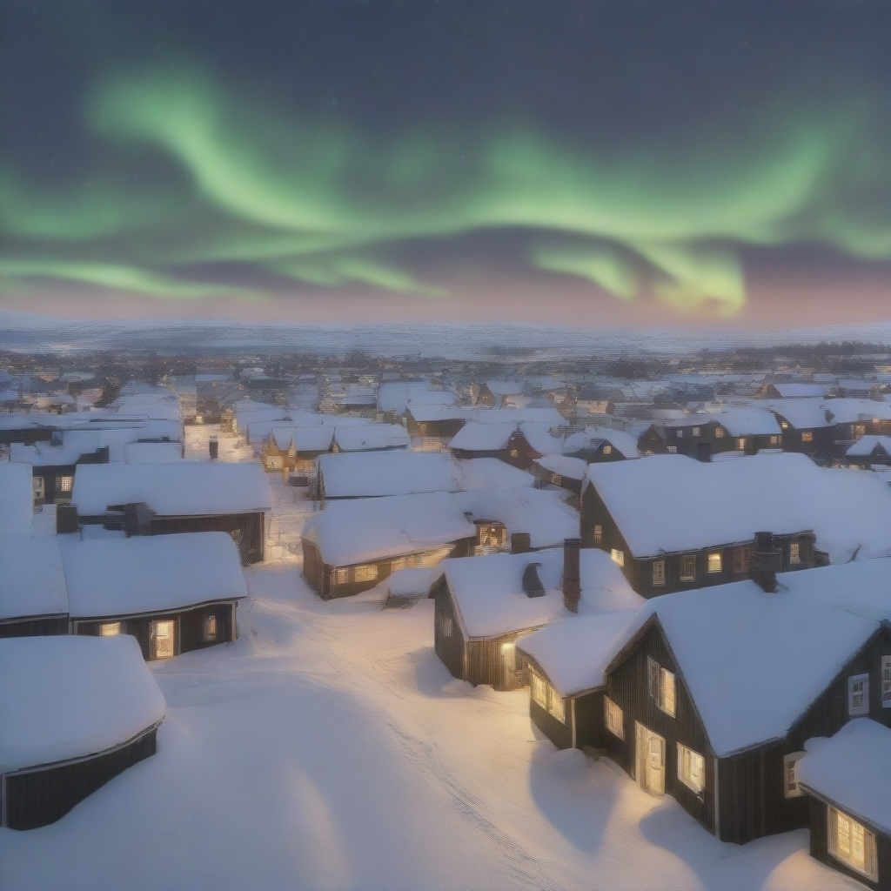

# LCM

Latent Consistency Models: Synthesizing High-Resolution Images with Few-step Inference

[](https://replicate.com/jyoung105/lcm/)

## Reference

[](https://latent-consistency-models.github.io/)
[](https://arxiv.org/abs/2310.04378)
[](https://github.com/luosiallen/latent-consistency-model)
[](https://huggingface.co/SimianLuo/LCM_Dreamshaper_v7)

## Example

1. A bustling Moroccan marketplace at sunset, with vibrant stalls displaying colorful textiles, spices, and lanterns, as merchants and shoppers engage in lively exchanges.


2. An underwater scene featuring a sunken pirate ship surrounded by coral reefs, schools of tropical fish, and a curious sea turtle exploring the wreckage.


3. A steampunk-inspired airship soaring above a Victorian-era city, with intricate gears and steam engines visible, and a crew of adventurers on deck.


4. A tranquil Scandinavian village during winter, with snow-covered rooftops, smoke rising from chimneys, and the Northern Lights illuminating the night sky.


5. A mystical desert landscape with towering sand dunes, an ancient, weathered statue half-buried in the sand, and a lone traveler approaching on camelback under a star-filled sky.


## Explanation

(Summarized by GPT-4o)

The paper titled "Latent Consistency Models: Synthesizing High-Resolution Images with Few-Step Inference" introduces Latent Consistency Models (LCMs) to enhance the efficiency of high-resolution image generation. Traditional Latent Diffusion Models (LDMs) are known for their high-quality outputs but often require numerous iterative sampling steps, leading to slow generation times. LCMs address this limitation by enabling rapid inference with minimal steps on pre-trained LDMs, including models like Stable Diffusion. 

**Key contributions of the paper include:**

* **Augmented Probability Flow ODE (PF-ODE):** The authors view the guided reverse diffusion process as solving an augmented PF-ODE. LCMs are designed to directly predict the solution of this ODE in the latent space, reducing the need for multiple iterations and allowing for swift, high-fidelity sampling.

* **Efficient Distillation Process:** LCMs are efficiently distilled from pre-trained classifier-free guided diffusion models. Notably, training a high-quality 768×768 resolution LCM with 2 to 4 inference steps requires only approximately 32 A100 GPU hours.

* **Latent Consistency Fine-tuning (LCF):** The paper introduces LCF, a novel method tailored for fine-tuning LCMs on customized image datasets, enhancing their adaptability to specific domains.

Evaluations on the LAION-5B-Aesthetics dataset demonstrate that LCMs achieve state-of-the-art text-to-image generation performance with few-step inference, significantly accelerating the generation process without compromising image quality.

## TODO
- [x] Inference code
- [ ] Method overview
- [ ] Train code

## Try

1. clone repo
```
git clone https://github.com/jyoung105/cog-diffusers
```

2. move to directory
```
cd ./cog-diffusers/Consistency/LCM
```

3. download weights before deployment
```
cog run scripts/download-weights
```

4. save pipeline before deployment
```
cog run scripts/save-weights
```

5. predict to inference
```
cog predict -i prompt="an illustration of a man with hoodie on"
```