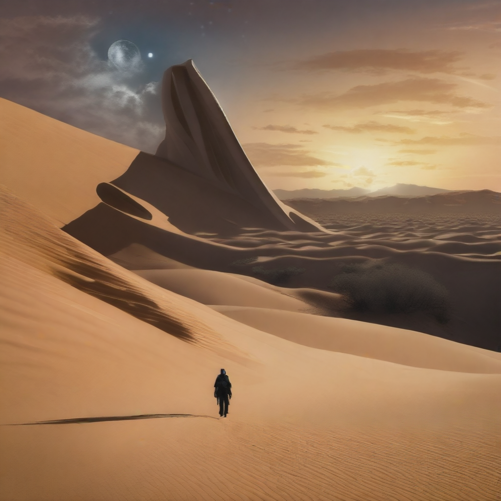

# PCM

Phased Consistency Model

[](https://replicate.com/jyoung105/pcm/)

## Reference

[](https://g-u-n.github.io/projects/pcm/)
[](https://arxiv.org/abs/2405.18407)
[](https://github.com/G-U-N/Phased-Consistency-Model)
[](https://huggingface.co/wangfuyun/PCM_Weights)

## Example

1. A bustling Moroccan marketplace at sunset, with vibrant stalls displaying colorful textiles, spices, and lanterns, as merchants and shoppers engage in lively exchanges.


2. An underwater scene featuring a sunken pirate ship surrounded by coral reefs, schools of tropical fish, and a curious sea turtle exploring the wreckage.


3. A steampunk-inspired airship soaring above a Victorian-era city, with intricate gears and steam engines visible, and a crew of adventurers on deck.


4. A tranquil Scandinavian village during winter, with snow-covered rooftops, smoke rising from chimneys, and the Northern Lights illuminating the night sky.


5. A mystical desert landscape with towering sand dunes, an ancient, weathered statue half-buried in the sand, and a lone traveler approaching on camelback under a star-filled sky.


## Abstract

(Summarized by GPT-4o)

The paper titled "Phased Consistency Model" introduces the Phased Consistency Model (PCM) to enhance high-resolution, text-conditioned image generation. Traditional Latent Consistency Models (LCMs) often face challenges such as limited flexibility in selecting Classifier-Free Guidance (CFG) scales, sensitivity to negative prompts, inconsistencies across different inference steps, and blurriness in low-step generation settings. 

To address these issues, 
**PCM segments the Ordinary Differential Equation (ODE) trajectory into multiple sub-trajectories**, facilitating more effective learning and mitigating the identified limitations. 

Evaluations demonstrate that PCM significantly outperforms LCMs across 1 to 16-step generation settings. Notably, PCM achieves superior or comparable one-step generation results compared to previously state-of-the-art methods specifically designed for one-step generation. Additionally, PCM's methodology extends to video generation, enabling the training of state-of-the-art few-step text-to-video generators. 

The authors have made additional resources available, including a project page and code repository, to facilitate further exploration and application of PCM.

## TODO
- [x] Inference code
- [ ] Method overview
- [ ] Train code

## Try

1. clone repo
```
git clone https://github.com/jyoung105/cog-diffusers
```

2. move to directory
```
cd ./cog-diffusers/Consistency/PCM
```

3. download weights before deployment
```
cog run scripts/download-weights
```

4. save pipeline before deployment
```
cog run scripts/save-weights
```

5. predict to inference
```
cog predict -i prompt="an illustration of a man with hoodie on"
```