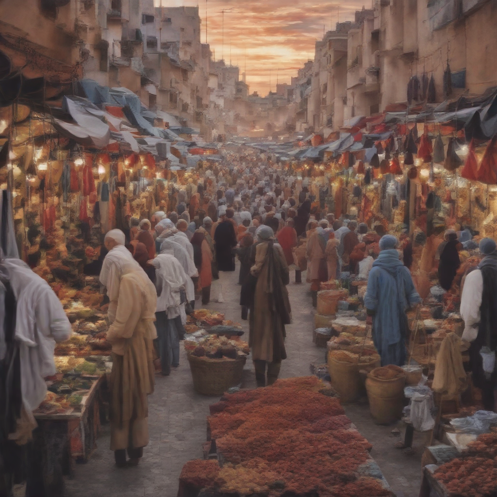
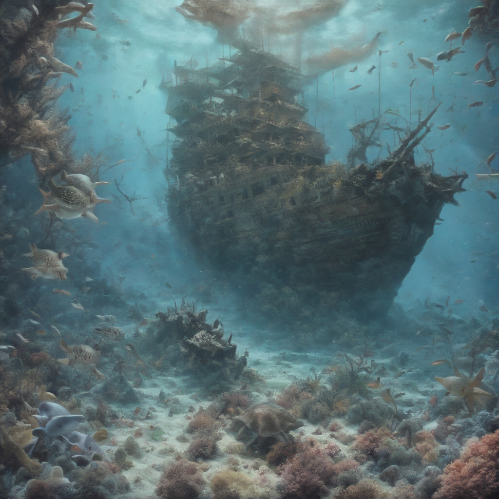
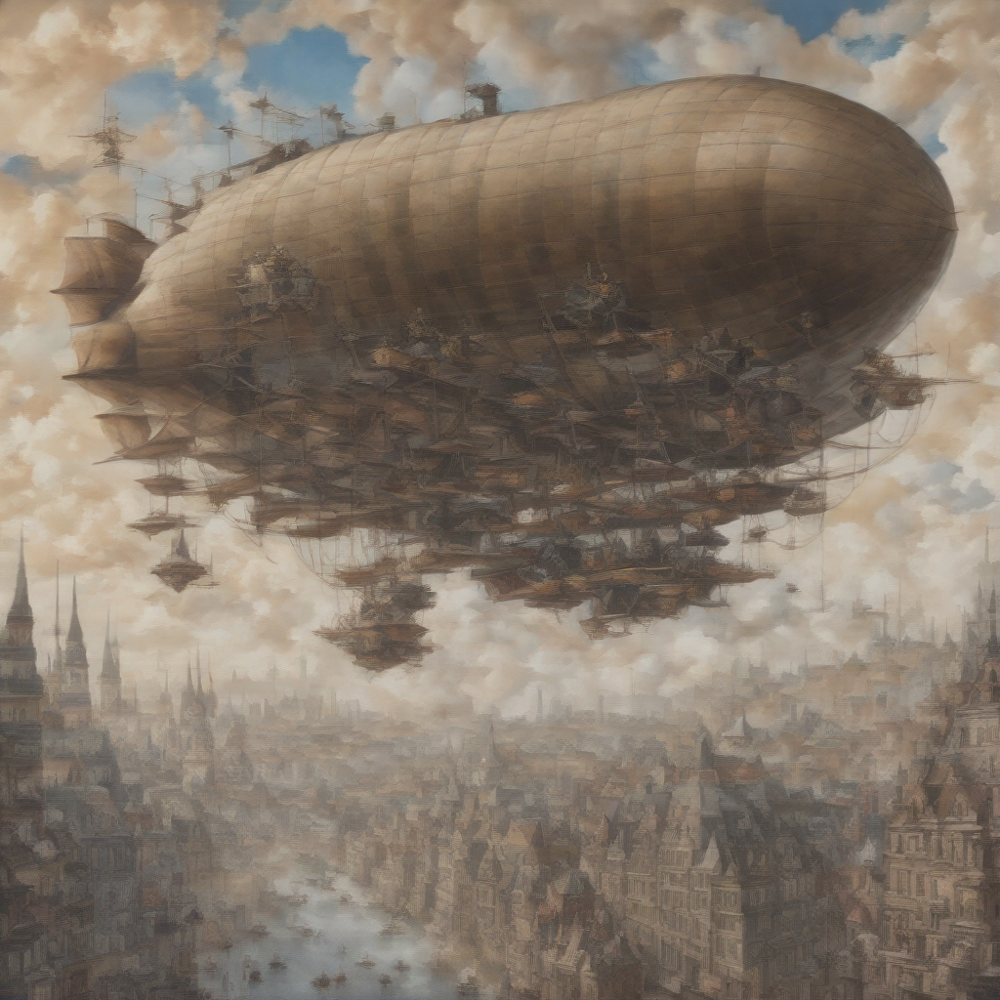
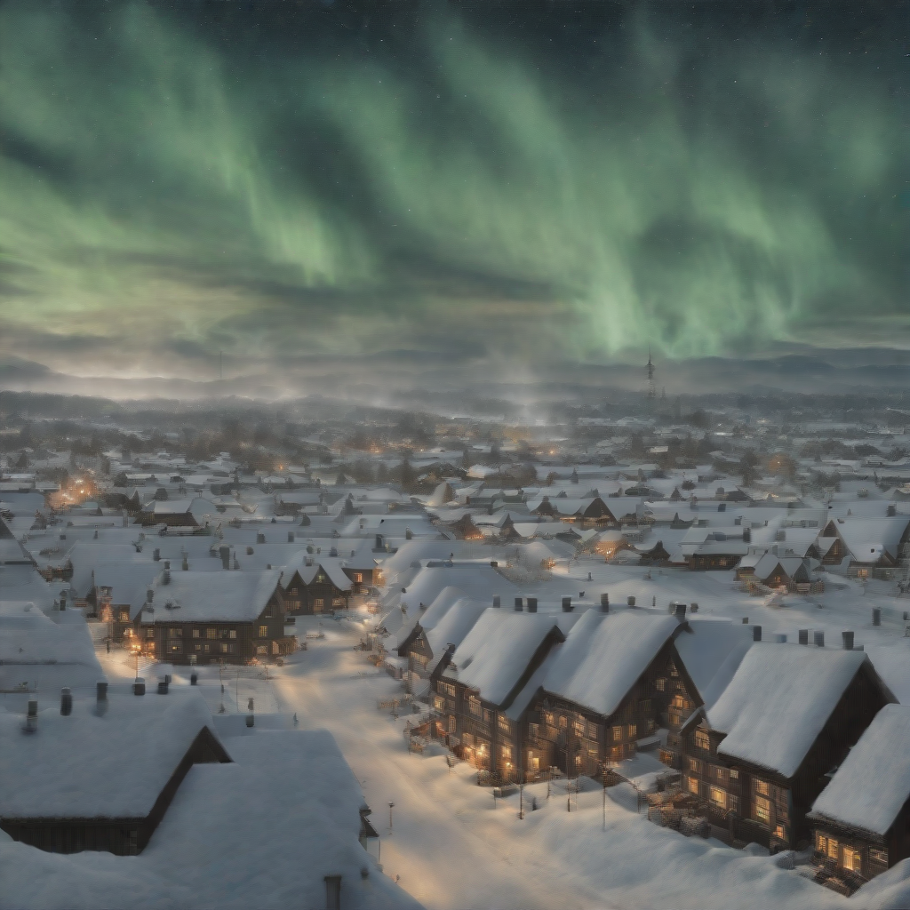
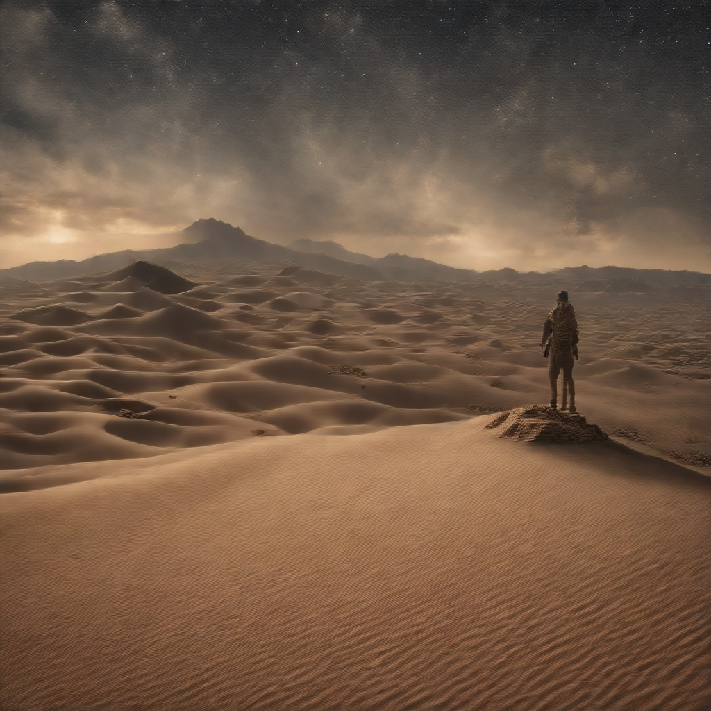

# ADD

Adversarial Diffusion Distillation

[](https://replicate.com/jyoung105/sdxl-turbo/)

## Reference

[](https://stability.ai/news/stability-ai-sdxl-turbo)
[](https://arxiv.org/pdf/2311.17042)
[](https://huggingface.co/stabilityai/sdxl-turbo)
[](https://huggingface.co/stabilityai/sd-turbo)

## Example

1. A bustling Moroccan marketplace at sunset, with vibrant stalls displaying colorful textiles, spices, and lanterns, as merchants and shoppers engage in lively exchanges.


2. An underwater scene featuring a sunken pirate ship surrounded by coral reefs, schools of tropical fish, and a curious sea turtle exploring the wreckage.


3. A steampunk-inspired airship soaring above a Victorian-era city, with intricate gears and steam engines visible, and a crew of adventurers on deck.


4. A tranquil Scandinavian village during winter, with snow-covered rooftops, smoke rising from chimneys, and the Northern Lights illuminating the night sky.


5. A mystical desert landscape with towering sand dunes, an ancient, weathered statue half-buried in the sand, and a lone traveler approaching on camelback under a star-filled sky.


## Abstract

(Summarized by GPT-4o)

The paper titled "Adversarial Diffusion Distillation" introduces a novel training approach aimed at enhancing the efficiency of large-scale image diffusion models. Traditional diffusion models, while capable of generating high-quality images, often require numerous sampling steps, leading to increased computational demands. This research presents Adversarial Diffusion Distillation (ADD), a method that enables efficient sampling in just 1 to 4 steps without compromising image quality. 

**Key Contributions:**

* **Integration of Score Distillation and Adversarial Loss:** ADD leverages score distillation to utilize large-scale, pre-trained image diffusion models as a teacher signal. This is combined with an adversarial loss to ensure high image fidelity, even when sampling steps are limited to one or two.

* **Performance Evaluation:** Analyses indicate that ADD outperforms existing few-step methods, such as Generative Adversarial Networks (GANs) and Latent Consistency Models, in single-step scenarios. Furthermore, it achieves performance comparable to state-of-the-art diffusion models, like SDXL, within just four sampling steps.

* **Real-Time Image Synthesis:** ADD is the first method to facilitate single-step, real-time image synthesis using foundational models, marking a significant advancement in the field.

The authors have made the code and model weights publicly available, promoting further research and application in this area.

## TODO
- [x] Inference code
- [ ] Method overview
- [ ] Train code

## Try

1. clone repo
```
git clone https://github.com/jyoung105/cog-diffusers
```

2. move to directory
```
cd ./cog-diffusers/Distillation/ADD
```

3. download weights before deployment
```
cog run scripts/download-weights
```

4. predict to inference
```
cog predict -i prompt="an illustration of a man with hoodie on"
```