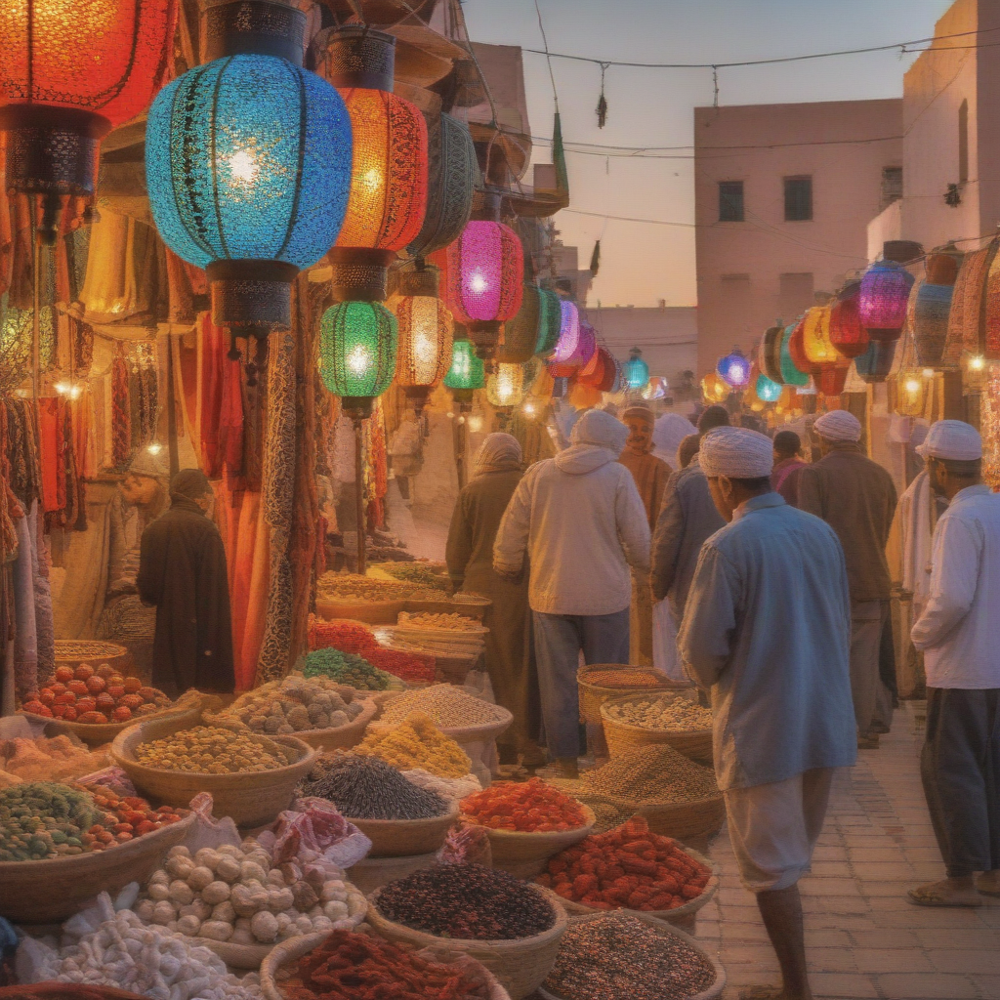
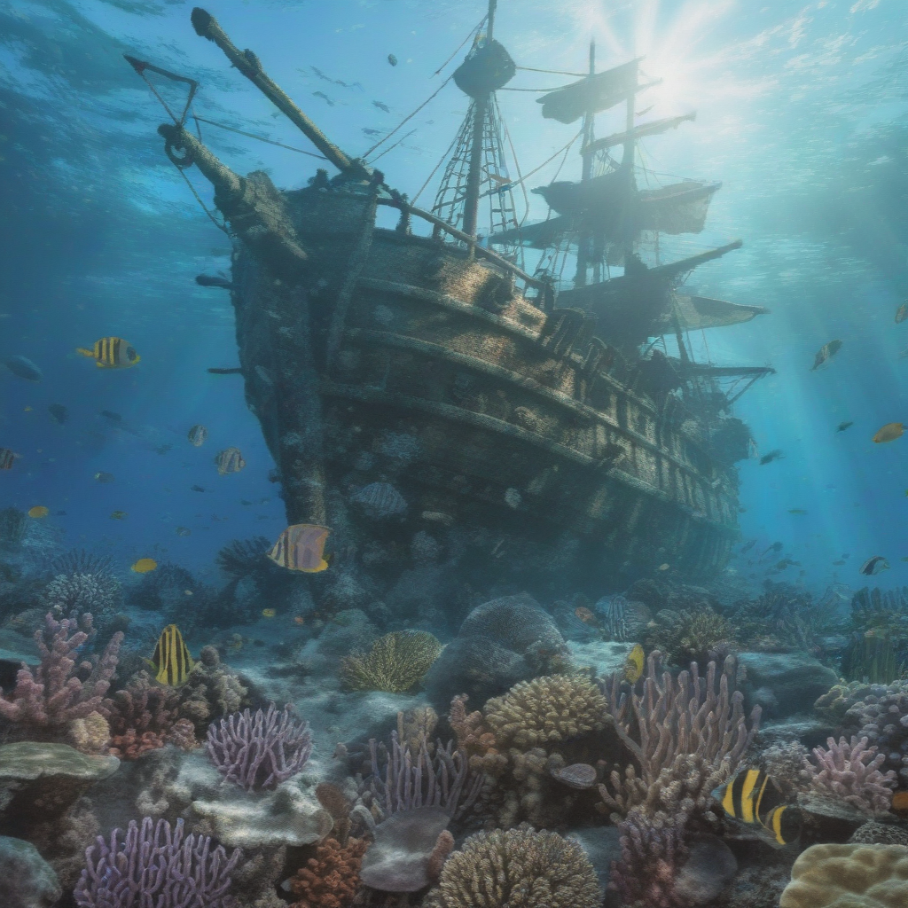
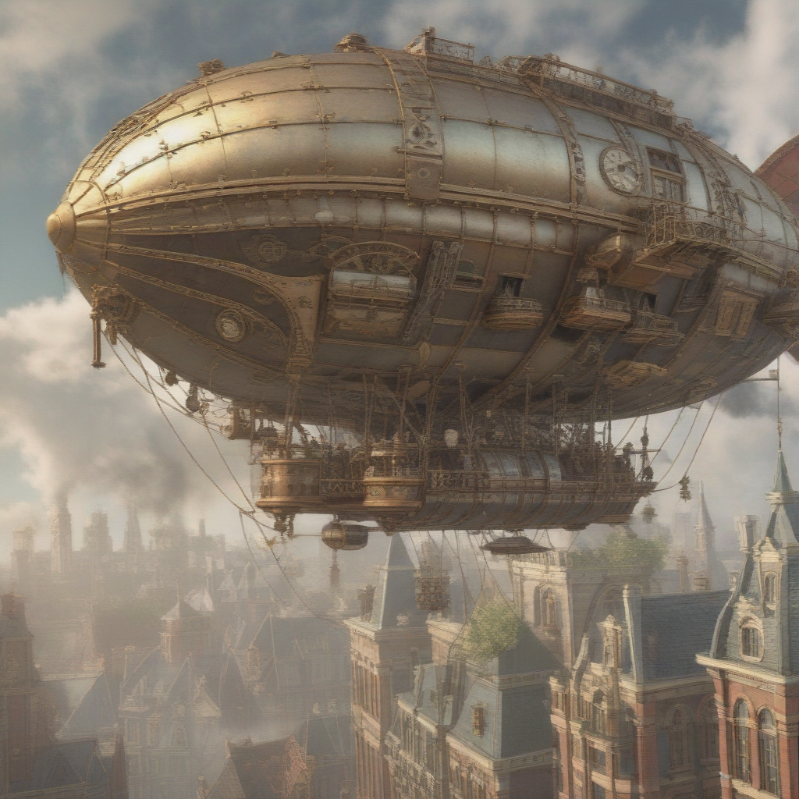
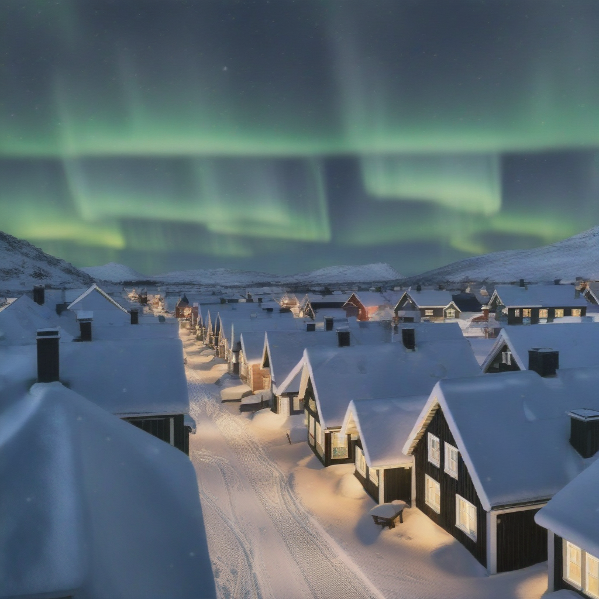
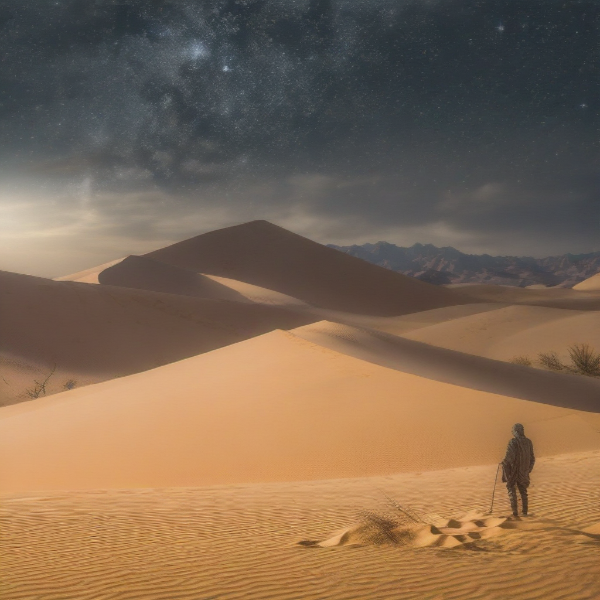

# DMD2

Improved Distribution Matching Distillation for Fast Image Synthesis

[](https://replicate.com/jyoung105/dmd2/)

## Reference

[](https://tianweiy.github.io/dmd2/)
[](https://arxiv.org/abs/2405.14867)
[](https://github.com/tianweiy/DMD2)
[](https://huggingface.co/tianweiy/DMD2)

## Example

1. A bustling Moroccan marketplace at sunset, with vibrant stalls displaying colorful textiles, spices, and lanterns, as merchants and shoppers engage in lively exchanges.


2. An underwater scene featuring a sunken pirate ship surrounded by coral reefs, schools of tropical fish, and a curious sea turtle exploring the wreckage.


3. A steampunk-inspired airship soaring above a Victorian-era city, with intricate gears and steam engines visible, and a crew of adventurers on deck.


4. A tranquil Scandinavian village during winter, with snow-covered rooftops, smoke rising from chimneys, and the Northern Lights illuminating the night sky.


5. A mystical desert landscape with towering sand dunes, an ancient, weathered statue half-buried in the sand, and a lone traveler approaching on camelback under a star-filled sky.


## Abstract

(Summarized by GPT-4o)

The paper titled "Improved Distribution Matching Distillation for Fast Image Synthesis" introduces DMD2, an enhanced approach to distilling diffusion models into efficient one-step generators. Traditional diffusion models, while capable of generating high-quality images, often require numerous sampling steps, leading to increased computational demands. DMD2 addresses these challenges by refining the Distribution Matching Distillation (DMD) process, resulting in faster and more efficient image synthesis. 

**Key Contributions:**

* **Elimination of Regression Loss:** DMD2 removes the need for an additional regression loss and the associated costly dataset construction, streamlining the training process.

* **Two Time-Scale Update Rule:** To counteract instability from the absence of regression loss, DMD2 implements a two time-scale update rule, ensuring accurate estimation of the distribution of generated samples.

* **Integration of GAN Loss:** By incorporating a Generative Adversarial Network (GAN) loss into the distillation procedure, DMD2 discriminates between generated samples and real images, enhancing the quality of the synthesized images.

* **Multi-Step Sampling Capability:** DMD2 modifies the training procedure to enable multi-step sampling, addressing the training-inference input mismatch by simulating inference-time generator samples during training.

Evaluations demonstrate that DMD2 sets new benchmarks in one-step image generation, achieving Fréchet Inception Distance (FID) scores of 1.28 on ImageNet-64x64 and 8.35 on zero-shot COCO 2014, surpassing the original teacher model despite a 500-fold reduction in inference cost. Additionally, DMD2 can generate megapixel images by distilling SDXL, showcasing exceptional visual quality among few-step methods. 

The authors have made the code, model, and dataset publicly available, facilitating further research and application in this domain.  

## TODO
- [x] Inference code
- [ ] Method overview
- [ ] Train code

## Try

1. clone repo
```
git clone https://github.com/jyoung105/cog-diffusers
```

2. move to directory
```
cd ./cog-diffusers/Distillation/DMD2
```

3. download weights before deployment
```
cog run scripts/download-weights
```

4. predict to inference
```
cog predict -i prompt="an illustration of a man with hoodie on"
```