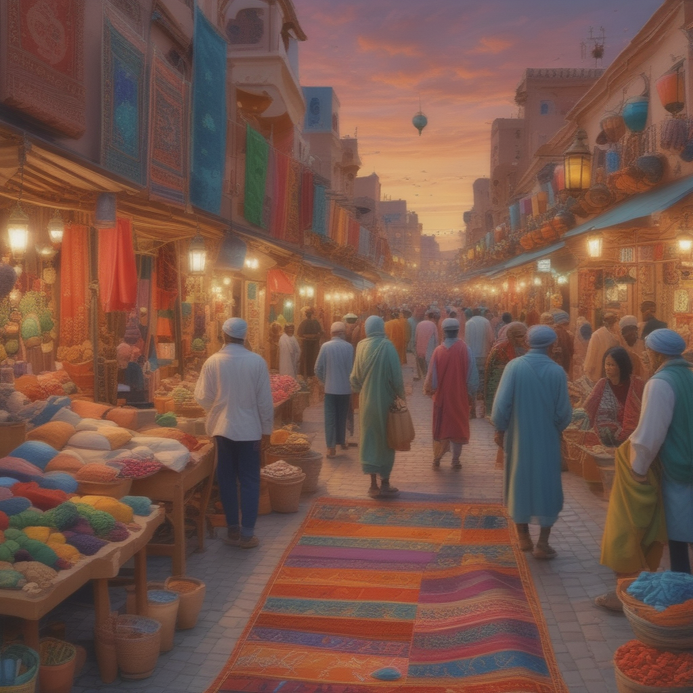

# Lightning

SDXL-Lightning: Progressive Adversarial Diffusion Distillation

[](https://replicate.com/jyoung105/lightning-turbo/)

## Reference

[](https://arxiv.org/abs/2402.13929)
[](https://huggingface.co/ByteDance/SDXL-Lightning)

## Example

1. A bustling Moroccan marketplace at sunset, with vibrant stalls displaying colorful textiles, spices, and lanterns, as merchants and shoppers engage in lively exchanges.


2. An underwater scene featuring a sunken pirate ship surrounded by coral reefs, schools of tropical fish, and a curious sea turtle exploring the wreckage.


3. A steampunk-inspired airship soaring above a Victorian-era city, with intricate gears and steam engines visible, and a crew of adventurers on deck.


4. A tranquil Scandinavian village during winter, with snow-covered rooftops, smoke rising from chimneys, and the Northern Lights illuminating the night sky.


5. A mystical desert landscape with towering sand dunes, an ancient, weathered statue half-buried in the sand, and a lone traveler approaching on camelback under a star-filled sky.


## Abstract

(Summarized by GPT-4o)

The paper titled "SDXL-Lightning: Progressive Adversarial Diffusion Distillation" introduces a novel method to enhance the efficiency of text-to-image generation models, specifically focusing on the Stable Diffusion XL (SDXL) framework. 

**Key Contributions:**

* **Progressive Adversarial Diffusion Distillation:** The authors propose a combined approach of progressive and adversarial distillation to balance image quality and mode coverage. This method ensures that the distilled model follows the original probability flow, maintaining consistency with the source model. 

* **Innovative Discriminator Design:** The study introduces a discriminator design that operates entirely in the latent space, utilizing the pre-trained diffusion UNet encoder as its backbone. This design enhances the model's ability to distinguish between real and generated images, improving the overall quality of the generated outputs. 

* **Open-Source Distilled Models:** The researchers have open-sourced their distilled SDXL-Lightning models, providing both Low-Rank Adaptation (LoRA) and full UNet weights. This availability facilitates further research and application in the field of efficient image generation. 

The proposed method achieves state-of-the-art performance in one-step and few-step 1024px text-to-image generation, significantly reducing computational requirements while maintaining high-quality outputs.  

## TODO
- [x] Inference code
- [ ] Method overview
- [ ] Train code

## Try

1. clone repo
```
git clone https://github.com/jyoung105/cog-diffusers
```

2. move to directory
```
cd ./cog-diffusers/Distillation/Lightning
```

3. download weights before deployment
```
cog run scripts/download-weights
```

4. predict to inference
```
cog predict -i prompt="an illustration of a man with hoodie on"
```