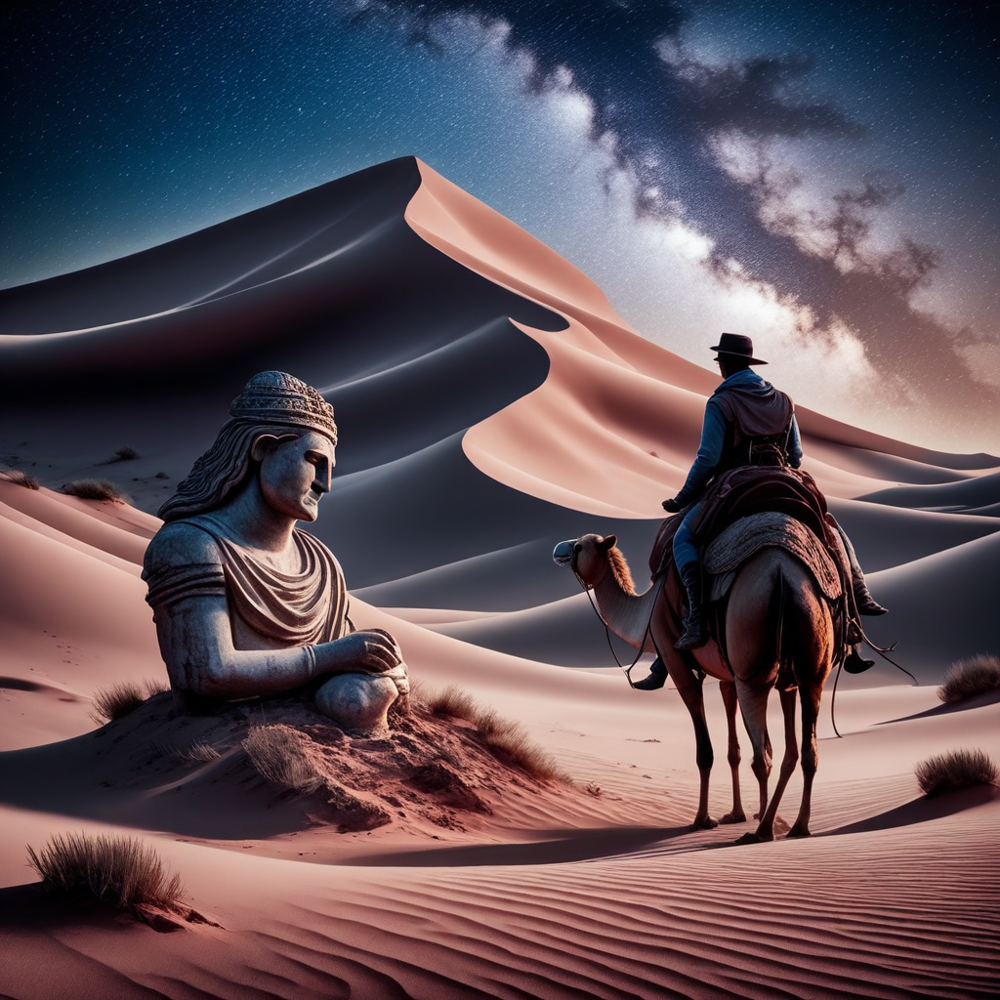

# AuraFlow-v0.1

AuraFlow: Fully open-sourced flow-based text-to-image generation model

[](https://replicate.com/jyoung105/auraflow-v1/)

## Reference

[](https://blog.fal.ai/auraflow/)
[](https://github.com/cloneofsimo/minRF)
[](https://huggingface.co/cloneofsimo/lavenderflow-5.6B)
[](https://huggingface.co/fal/AuraFlow)

## Example

1. A bustling Moroccan marketplace at sunset, with vibrant stalls displaying colorful textiles, spices, and lanterns, as merchants and shoppers engage in lively exchanges.


2. An underwater scene featuring a sunken pirate ship surrounded by coral reefs, schools of tropical fish, and a curious sea turtle exploring the wreckage.


3. A steampunk-inspired airship soaring above a Victorian-era city, with intricate gears and steam engines visible, and a crew of adventurers on deck.


4. A tranquil Scandinavian village during winter, with snow-covered rooftops, smoke rising from chimneys, and the Northern Lights illuminating the night sky.


5. A mystical desert landscape with towering sand dunes, an ancient, weathered statue half-buried in the sand, and a lone traveler approaching on camelback under a star-filled sky.


## Explanation

(Summarized by GPT-4o)

The article titled "Introducing AuraFlow v0.1, an Open Exploration of Large Rectified Flow Models" announces the release of AuraFlow v0.1, a significant advancement in open-source, flow-based text-to-image generation models. 

**Key Highlights:**

* **Open-Source Commitment:** AuraFlow v0.1 stands as the largest fully open-source flow-based text-to-image generation model, reaffirming the resilience and dedication of the open-source AI community. 

* **Prompt Adherence:** The model demonstrates exceptional capability in following complex prompts, producing detailed and accurate images based on user input. 

* **Community Collaboration:** Developed in collaboration with researcher Simo, known for his work on adapting the LoRA paper for text-to-image models, AuraFlow reflects a successful partnership aimed at scaling and optimizing model training. 

* **Technical Innovations:** The development process involved optimizing model configurations for large-scale training, utilizing tools like Torch Dynamo and Inductor to enhance performance. The team also addressed challenges related to distributed training on multi-modal data, leveraging expertise in managing large GPU clusters and distributed storage. 

* **Future Directions:** The initial release of AuraFlow v0.1 aims to engage the community in further experimentation and development. Plans include continued training, applying insights from this release, and exploring more efficient models suitable for consumer-grade GPUs. 

The article encourages community participation in experimenting with AuraFlow v0.1 and contributing to its evolution, highlighting the model's potential as a foundational tool for future innovations in generative AI.  

## TODO
- [x] Inference code
- [ ] Method overview
- [ ] Train code
- [ ] Accelerate inference
- [ ] Reduce memory usage
- [ ] Train LoRA, ControlNet, IPAdapter

## Try

1. clone repo
```
git clone https://github.com/jyoung105/cog-diffusers
```

2. move to directory
```
cd ./cog-diffusers/Normal/Auraflow/v01
```

3. download weights before deployment
```
cog run scripts/download-weights
```

4. save pipeline before deployment
```
cog run scripts/save-weights
```

5. predict to inference
```
cog predict -i prompt="an illustration of a man with hoodie on"
```