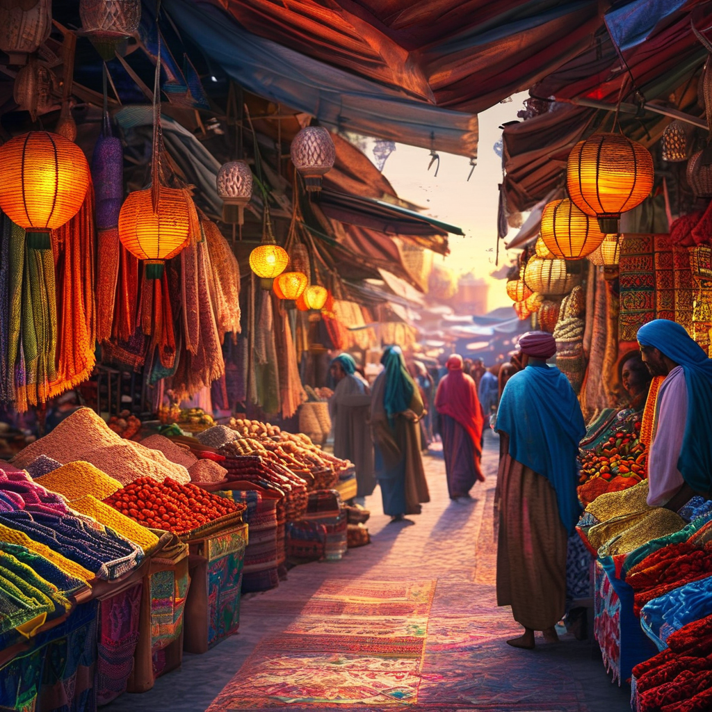
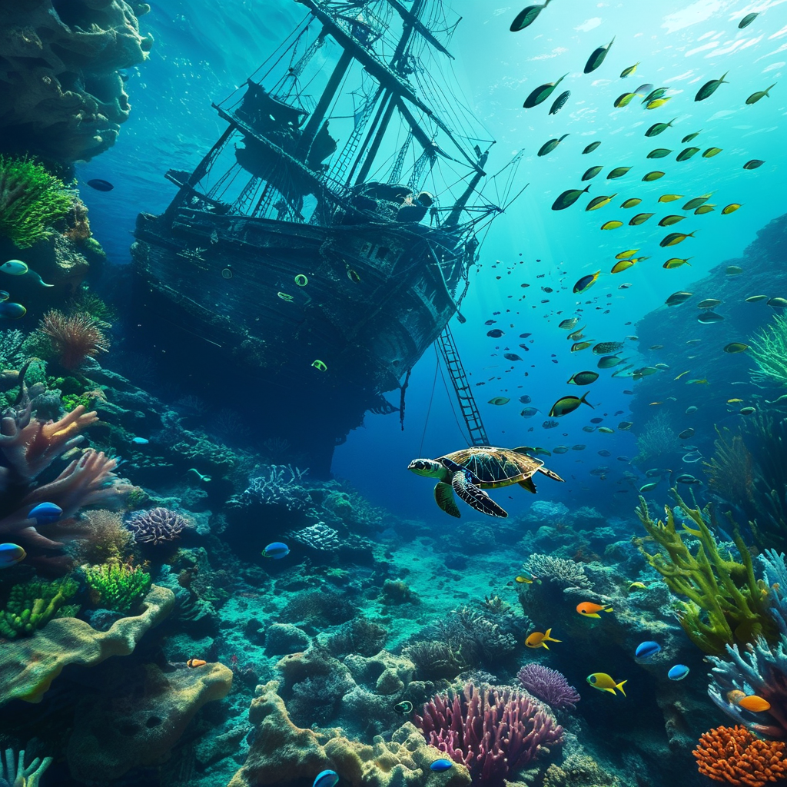
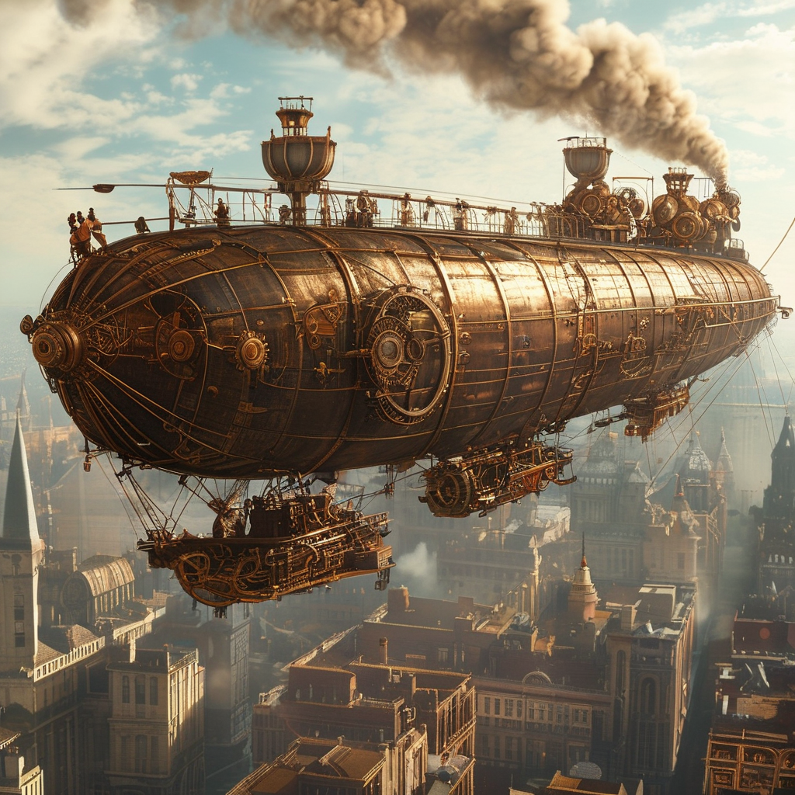
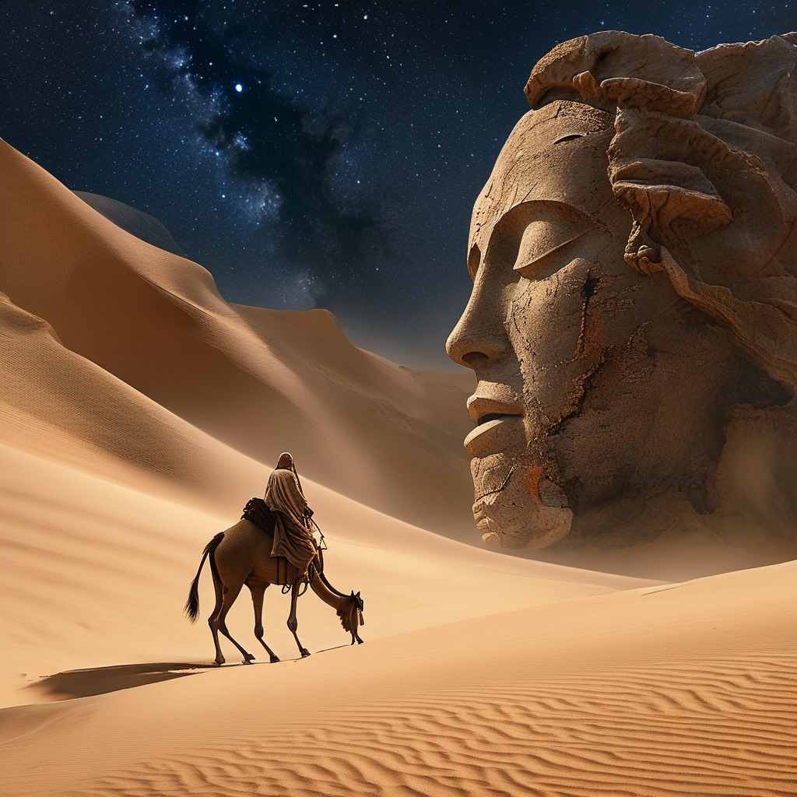

# AuraFlow-v0.3

AuraFlow: Fully open-sourced flow-based text-to-image generation model

[](https://replicate.com/jyoung105/auraflow-v3/)

## Reference

[](https://blog.fal.ai/auraflow/)
[](https://github.com/cloneofsimo/minRF)
[](https://huggingface.co/cloneofsimo/lavenderflow-5.6B)
[](https://huggingface.co/fal/AuraFlow-v0.3)

## Example

1. A bustling Moroccan marketplace at sunset, with vibrant stalls displaying colorful textiles, spices, and lanterns, as merchants and shoppers engage in lively exchanges.


2. An underwater scene featuring a sunken pirate ship surrounded by coral reefs, schools of tropical fish, and a curious sea turtle exploring the wreckage.


3. A steampunk-inspired airship soaring above a Victorian-era city, with intricate gears and steam engines visible, and a crew of adventurers on deck.


4. A tranquil Scandinavian village during winter, with snow-covered rooftops, smoke rising from chimneys, and the Northern Lights illuminating the night sky.


5. A mystical desert landscape with towering sand dunes, an ancient, weathered statue half-buried in the sand, and a lone traveler approaching on camelback under a star-filled sky.


## Explanation

(Summarized by GPT-4o)

AuraFlow v0.3 is an open-source, flow-based text-to-image generation model developed by fal. Building upon its predecessor, AuraFlow v0.2, this version has been trained with increased computational resources and fine-tuned on more aesthetic datasets, resulting in enhanced performance. Notably, AuraFlow v0.3 achieves state-of-the-art results on the GenEval benchmark, underscoring its advanced capabilities in generating high-quality images from textual descriptions. 

The model now supports various aspect ratios, with width and height up to 1536 pixels, providing greater flexibility in image generation. It is currently in beta, and the developers are actively seeking community feedback to further refine and improve its performance. Users are encouraged to join fal's Discord channel to provide input and stay updated on ongoing developments. 

For those interested in utilizing AuraFlow v0.3, the developers have provided detailed usage instructions, including necessary installations and code snippets, to facilitate seamless integration into various projects. 

The development of AuraFlow v0.3 is credited to @cloneofsimo and @isidentical, whose collaborative efforts have been instrumental in bringing this project to fruition. Their work builds upon prior research in the field, contributing to the model's advanced capabilities. 

Overall, AuraFlow v0.3 represents a significant advancement in open-source text-to-image generation, offering users a powerful tool for creating high-quality images based on textual input.

## TODO
- [x] Inference code
- [ ] Method overview
- [ ] Train code
- [ ] Accelerate inference
- [ ] Reduce memory usage
- [ ] Train LoRA, ControlNet, IPAdapter

## Try

1. clone repo
```
git clone https://github.com/jyoung105/cog-diffusers
```

2. move to directory
```
cd ./cog-diffusers/Normal/Auraflow/v03
```

3. download weights before deployment
```
cog run scripts/download-weights
```

4. save pipeline before deployment
```
cog run scripts/save-weights
```

5. predict to inference
```
cog predict -i prompt="an illustration of a man with hoodie on"
```