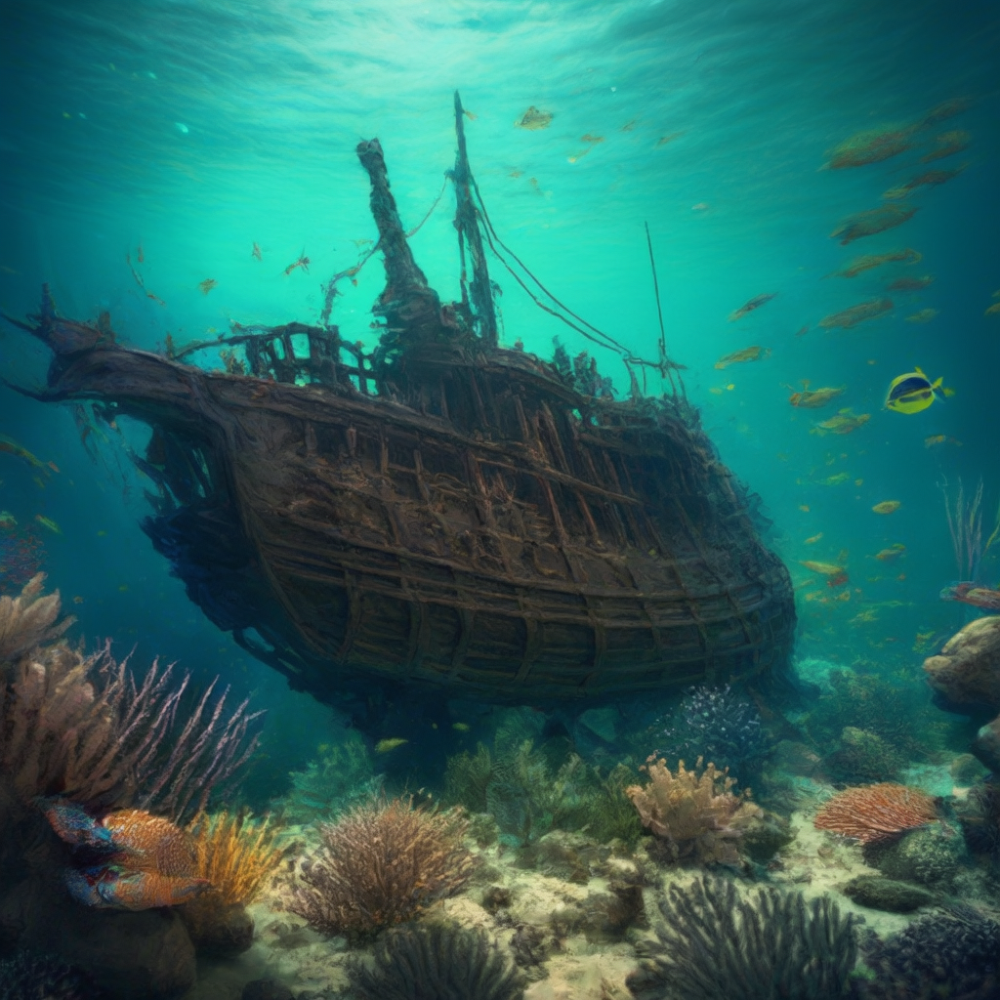
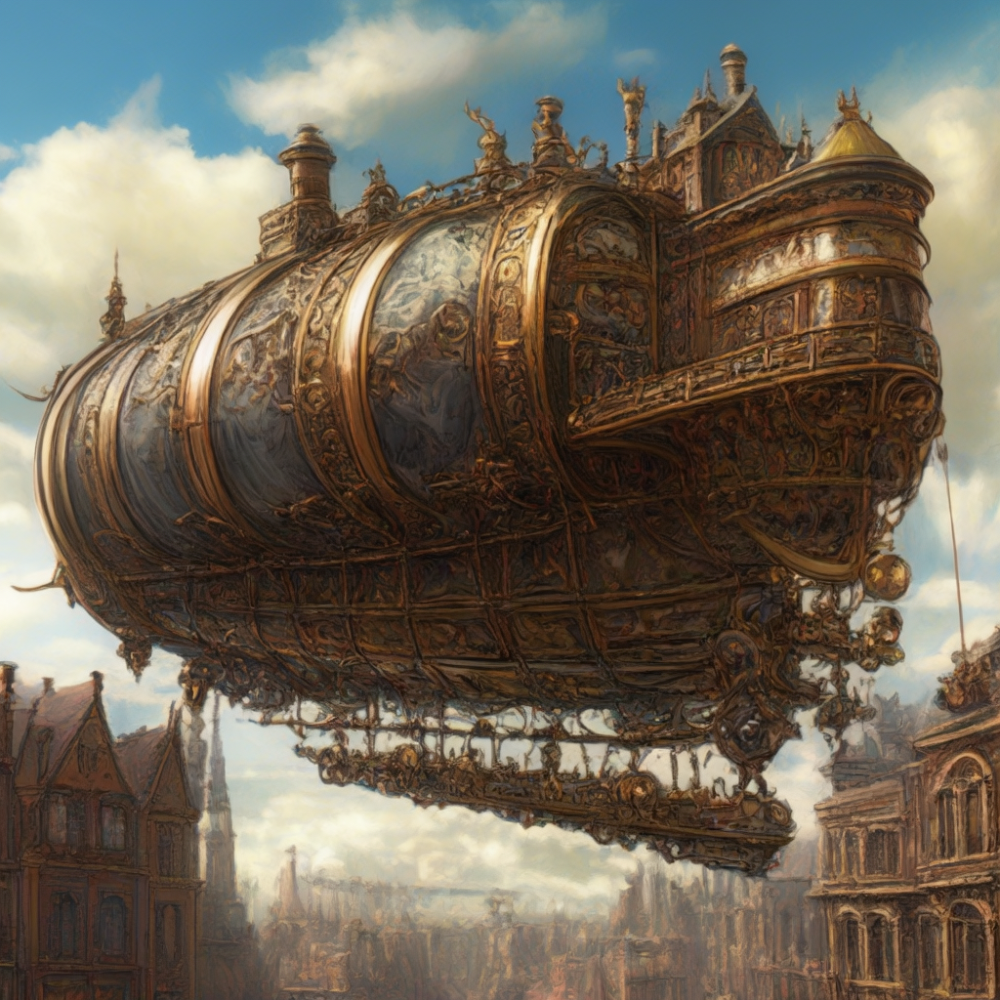

# Stable Cascade

Würstchen: An Efficient Architecture for Large-Scale Text-to-Image Diffusion Models

[](https://replicate.com/jyoung105/stable-cascade/)

## Reference

[](https://stability.ai/news/introducing-stable-cascade)
[](https://arxiv.org/abs/2306.00637)
[](https://github.com/Stability-AI/StableCascade)
[](https://huggingface.co/stabilityai/stable-cascade)

## Example

1. A bustling Moroccan marketplace at sunset, with vibrant stalls displaying colorful textiles, spices, and lanterns, as merchants and shoppers engage in lively exchanges.


2. An underwater scene featuring a sunken pirate ship surrounded by coral reefs, schools of tropical fish, and a curious sea turtle exploring the wreckage.


3. A steampunk-inspired airship soaring above a Victorian-era city, with intricate gears and steam engines visible, and a crew of adventurers on deck.


4. A tranquil Scandinavian village during winter, with snow-covered rooftops, smoke rising from chimneys, and the Northern Lights illuminating the night sky.


5. A mystical desert landscape with towering sand dunes, an ancient, weathered statue half-buried in the sand, and a lone traveler approaching on camelback under a star-filled sky.


## Explanation

(Summarized by GPT-4o)

Stability AI has introduced **Stable Cascade**, an innovative text-to-image model that employs a three-stage approach to enhance image generation quality and efficiency. 

**Key Features:**

* **Three-Stage Architecture:** Stable Cascade consists of three distinct stages—A, B, and C—that work together to achieve hierarchical image compression, resulting in high-quality outputs from a compact latent space. 

* **Latent Generator (Stage C):** This phase transforms user inputs into compact 24x24 latent representations, which are then processed by the subsequent stages. 

* **Latent Decoder (Stages A & B):** These stages decode the latent representations into high-resolution images, similar to the function of the Variational Autoencoder (VAE) in Stable Diffusion models, but with higher compression rates. 

* **Efficient Training and Fine-Tuning:** By decoupling text-conditional generation from high-resolution decoding, Stable Cascade allows for more efficient training and fine-tuning, including the integration of ControlNets and Low-Rank Adaptation (LoRA) modules. 

* **Model Variants:** The model is available in different parameter sizes—1B and 3.6B for Stage C, and 700M and 1.5B for Stage B—catering to various hardware capabilities and performance requirements. 

Stability AI has released training and inference code on their [GitHub page](https://github.com/Stability-AI), enabling users to customize and experiment with Stable Cascade. The model is also accessible for inference through the [Diffusers library](https://huggingface.co/docs/diffusers/index). 

This release underscores Stability AI's commitment to advancing open-source AI technologies, providing the community with tools to explore and innovate in the field of image generation.  

## TODO
- [x] Inference code
- [ ] Method overview
- [ ] Train code
- [ ] Accelerate inference
- [x] Reduce memory usage
- [ ] Train LoRA, ControlNet, IPAdapter

## Try

1. clone repo
```
git clone https://github.com/jyoung105/cog-diffusers
```

2. move to directory
```
cd ./cog-diffusers/Normal/Cascade
```

3. download weights before deployment
```
cog run scripts/download-weights
```

4. save pipeline before deployment
```
cog run scripts/save-weights
```

5. predict to inference
```
cog predict -i prompt="an illustration of a man with hoodie on"
```