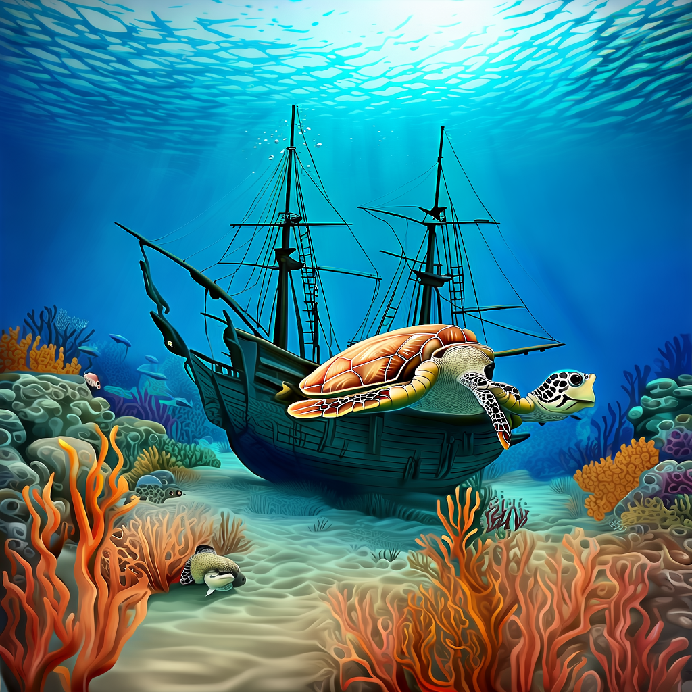

# CogView 3 Plus

CogView3: Finer and Faster Text-to-Image Generation via Relay Diffusion

[](https://replicate.com/jyoung105/cogview-v3-plus/)

## Reference

[](https://arxiv.org/pdf/2403.05121)
[](https://github.com/THUDM/CogView3)
[](https://huggingface.co/THUDM/CogView3-Plus-3B)

## Example

1. A bustling Moroccan marketplace at sunset, with vibrant stalls displaying colorful textiles, spices, and lanterns, as merchants and shoppers engage in lively exchanges.


2. An underwater scene featuring a sunken pirate ship surrounded by coral reefs, schools of tropical fish, and a curious sea turtle exploring the wreckage.


3. A steampunk-inspired airship soaring above a Victorian-era city, with intricate gears and steam engines visible, and a crew of adventurers on deck.


4. A tranquil Scandinavian village during winter, with snow-covered rooftops, smoke rising from chimneys, and the Northern Lights illuminating the night sky.


5. A mystical desert landscape with towering sand dunes, an ancient, weathered statue half-buried in the sand, and a lone traveler approaching on camelback under a star-filled sky.


## Abstract

(Summarized by GPT-4o)

The paper titled "CogView3: Finer and Faster Text-to-Image Generation via Relay Diffusion" introduces **CogView3**, a text-to-image generation model that employs a novel relay diffusion framework to enhance both image quality and generation speed. 

**Key Contributions:**

1. **Relay Diffusion Framework:** CogView3 is the first model to implement relay diffusion in text-to-image generation. It generates low-resolution images initially and then applies relay-based super-resolution techniques to produce high-quality outputs. This approach significantly reduces training and inference costs while maintaining competitive performance. 

2. **Performance Improvement:** Experimental results demonstrate that CogView3 outperforms SDXL, the current state-of-the-art open-source text-to-image diffusion model, by 77.0% in human evaluations, all while requiring only about half of the inference time. 

3. **Distilled Variant Efficiency:** The distilled variant of CogView3 achieves comparable performance to SDXL but utilizes only one-tenth of the inference time, highlighting its efficiency. 

Overall, CogView3 presents a significant advancement in text-to-image generation, offering a more efficient and faster alternative to existing models without compromising on image quality.  

## TODO
- [x] Inference code
- [ ] Method overview
- [ ] Train code
- [ ] Accelerate inference
- [ ] Reduce memory usage
- [ ] Train LoRA, ControlNet, IPAdapter

## Try

1. clone repo
```
git clone https://github.com/jyoung105/cog-diffusers
```

2. move to directory
```
cd ./cog-diffusers/Normal/CogView/v3-plus
```

3. download weights before deployment
```
cog run scripts/download-weights
```

4. save pipeline before deployment
```
cog run scripts/save-weights
```

5. predict to inference
```
cog predict -i prompt="an illustration of a man with hoodie on"
```